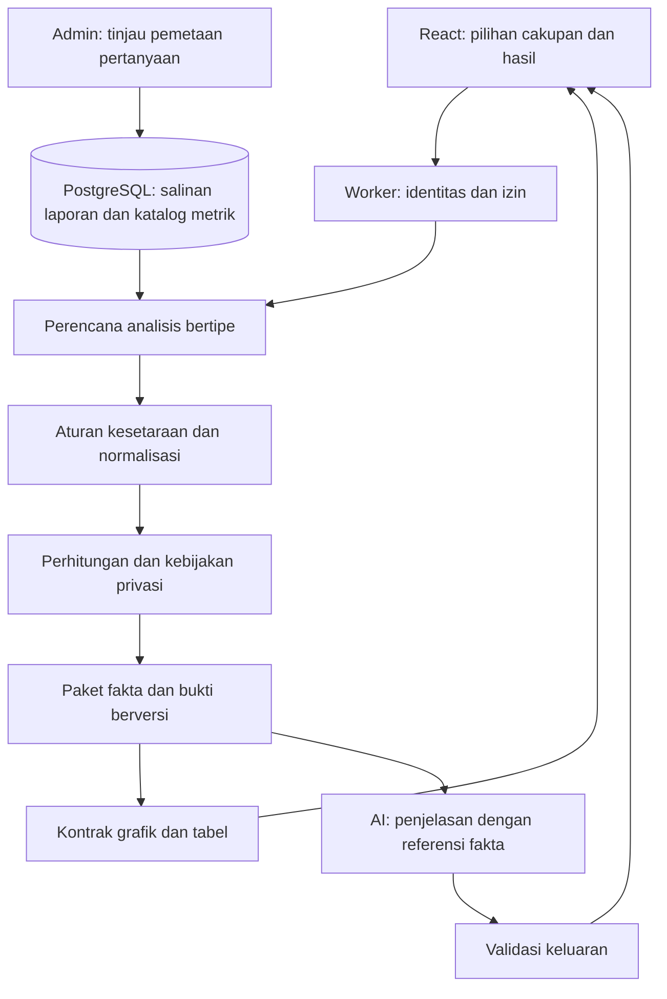

# Arsitektur analisis STICA: perbandingan survei dan hasil AI

Status: rancangan implementasi v1, 5 September 2026. Belum diterapkan. Dokumen ini menetapkan target desain; tidak menyatakan sistem saat ini sudah memenuhi seluruh kontrol di bawah. Fitur dokumen perusahaan tetap di luar lingkup. Tidak ada panggilan AI atau perubahan database yang dilakukan untuk menyusun rancangan ini.

## 1. Keputusan arsitektur

Pertahankan React/TypeScript, Cloudflare Worker dan Supabase PostgreSQL. Gunakan satu aplikasi dengan modul domain yang tegas. Pemisahan layanan jaringan baru hanya dilakukan setelah pengukuran menunjukkan kebutuhan isolasi kapasitas atau operasional.

Pusat sistem adalah **paket analisis berversi**: sumber tetap, pemetaan metrik yang disetujui, keputusan kelayakan, fakta hasil hitung, dan bukti. Grafik dan narasi menggunakan paket yang sama. Model AI tidak menjadi sumber angka, izin akses, atau keputusan bahwa dua metrik boleh digabung.



**Invarian wajib:**

1. Identitas pertanyaan, nomor tampilan, dan identitas metrik adalah tiga hal berbeda.
2. Satu angka mempunyai sumber, satuan, metode, cakupan, periode dan penyebut yang diketahui.
3. Ketidakpastian pemetaan menghentikan perhitungan lintas versi; tidak diubah menjadi tebakan.
4. Jawaban mentah dan definisi historis tidak ditulis ulang oleh normalisasi atau AI.
5. Privasi diperiksa setelah pemilihan kelompok dan sebelum bukti keluar dari batas server.
6. Pengulangan analisis dengan sumber dan versi aturan yang sama menghasilkan fakta yang sama. Narasi model dapat berbeda; hasil narasi sebelumnya disimpan sebagai artefak tersendiri.
7. Kegagalan AI tidak menghilangkan tabel, grafik, atau fakta yang sudah valid.
8. Data sintetis tidak ikut rata-rata produksi secara default.

## 2. Kondisi kode yang menjadi titik awal

| Komponen saat ini | Target perubahan |
|---|---|
| `question_definitions`, `question_revisions`, `survey_questions` | Tetap menjadi sumber identitas, redaksi dan penempatan pertanyaan. Tambahkan katalog metrik dan pemetaan eksplisit. |
| `shared/question-comparison.ts` | Pencocokan literal menjadi pemeriksaan awal perubahan struktur; bukan keputusan akhir kesetaraan makna. |
| `worker/services/analysis/load.ts` | Saat ini membaca tabel `answers` yang dapat berubah melalui alur koreksi/impor. Ganti dengan pemilihan salinan analisis tetap. |
| `worker/services/analysis/evidence.ts` | Pisahkan ekstraksi, kelayakan, statistik, privasi dan bukti. Metadata kesetaraan saat ini hanya masuk grafik; targetnya dipakai seluruh hasil. |
| `worker/routes/explorer.ts` | AI menerima fakta terotorisasi dan keputusan perbandingan; sumber menggunakan ID bukti unik, bukan hanya key/tahun/scope. |
| `AnalysisCharts.tsx`, `YearTrend.tsx` | Komponen presentasi menerima domain sumbu, jenis seri, satuan dan status yang ditentukan server. |
| `worker/services/governance.ts` | Pemeriksaan biaya lalu pencatatan saat ini terpisah. Ganti dengan reservasi atomik untuk mencegah permintaan bersamaan melampaui anggaran. |

Dokumentasi lama tentang snapshot ringkasan tidak otomatis berlaku untuk explorer. Implementasi tiap jalur harus diverifikasi secara terpisah.

## 3. Model domain dan penyimpanan

Nama berikut adalah objek baru yang diusulkan, bukan tabel yang sudah tersedia. Gunakan UUID untuk identitas artefak baru, `timestamptz` untuk waktu, FK ke ID bigint yang sudah ada, dan `numeric` untuk nilai serta konversi desimal. JSONB hanya untuk konfigurasi bertipe dan paket berversi; kolom relasi, status dan otorisasi tetap eksplisit.

| Objek | Isi inti dan constraint |
|---|---|
| `metric_definitions` | `id`, `code UNIQUE`, nama dan pemilik definisi. Contoh: `workforce.headcount`, `workforce.fte`; keduanya metrik berbeda. |
| `metric_revisions` | FK definisi, nomor revisi unik per definisi, tipe nilai, unit, periode pengukuran, populasi, metode, batas cakupan, agregasi yang diizinkan dan arah interpretasi. Revisi terbit tidak dapat diedit. |
| `mapping_proposals` | Kandidat hubungan dari admin atau AI, sumber kandidat, alasan, versi model bila ada, status tinjauan. Kandidat tidak dapat digunakan mesin hitung. |
| `mapping_releases` | Versi paket pemetaan, `draft / published / retired / revoked`, pembuat, peninjau, hash konfigurasi dan waktu publikasi. Pembuat dan peninjau berbeda untuk publikasi pemetaan semantik/konversi. |
| `mapping_rules` | FK release dan revisi metrik target, relasi `identity / equivalent / convertible / partial / incompatible`, transformasi bertipe, alasan dan daftar operasi yang diizinkan. |
| `mapping_rule_sources` | FK aturan, FK `survey_questions`, ID revisi pertanyaan yang diharapkan, jalur subfield, peran sumber serta schema hash. Unik per aturan/sumber/jalur. |
| `analysis_source_packs` | FK snapshot laporan asal, versi format, tahun dan revisi laporan, organisasi, klasifikasi data, payload jawaban + skema + kondisi tampil yang dibekukan, hash dan asal rekonstruksi. Append-only untuk koreksi normal. |
| `analysis_runs` | Pemilik pengguna/organisasi, permintaan ternormalisasi, idempotency key, status, versi mesin/privasi/pemetaan, manifest sumber, waktu, status narasi dan referensi reservasi biaya. |
| `analysis_run_inputs` | FK run dan source pack. Unique keduanya. Manifest tidak berubah setelah run siap dihitung. |
| `analysis_artifacts` | FK run, jenis `facts / charts / narrative`, versi schema, payload, checksum, status validasi dan waktu pembuatan. Fakta mentah internal dipisahkan dari proyeksi yang boleh dikirim. |
| `analysis_budget_ledgers` | Scope platform/organisasi dan bulan UTC yang unik, batas biaya, pengeluaran dan reservasi aktif; dikunci oleh transaksi reservasi. |
| `analysis_budget_reservations` | FK run/permintaan narasi, key permintaan unik, estimasi, actual cost dan status `reserved / settled / released / outcome_unknown`. Satu permintaan menahan kapasitas platform dan organisasi secara atomik. |
| `analysis_outbox` | Dibangun pada tahap async: FK run, jenis pekerjaan, key deduplikasi unik, lease, jumlah percobaan dan waktu ketersediaan. Intent dispatch ditulis dalam transaksi pembuatan pekerjaan. |

`mapping_rules` dan sumbernya mengakomodasi satu-ke-banyak atau banyak-ke-satu. Mesin menolak dua aturan aktif yang menyumbangkan observasi ganda untuk perusahaan, metrik, periode dan cakupan yang sama. Pemecahan pertanyaan hanya dapat dijumlahkan jika komponen dinyatakan tidak tumpang tindih dan lengkap; penjumlahan bukan aturan default.

Indeks awal: `metric_revisions(definition_id, revision_number)` unique; sumber aturan `(survey_question_id, field_path)`; source packs `(organization_id, reporting_year, captured_at)`; input run `(run_id, source_pack_id)` unique; run `(owner_user_id, created_at DESC)` dan `(status, created_at)`; artefak `(run_id, kind, schema_version)`. Indeks tambahan berdasarkan rencana query dan pengukuran, bukan semua kolom JSON.

Gunakan schema privat untuk aturan internal, sumber rekan perusahaan, manifest dan artefak internal. Cabut akses browser langsung; aktifkan RLS sebagai lapisan tambahan. Akses melalui RPC terbatas yang memeriksa `auth.uid()`, role dan keanggotaan aktif. Fungsi definer berada di `app_private`, memakai search path kosong, tanpa SQL dinamis dari input. Wrapper publik hanya membuka operasi yang diperlukan.

## 4. Salinan data dan konsistensi waktu

Saat laporan disubmit atau koreksi historis diterima, transaksi membuat source pack dari jawaban dan skema yang konsisten. Simpan identitas dan redaksi revisi, opsi, unit, field, visibility rule serta hasil applicability pada saat tersebut. Pilih sumber yang berstatus diterima; draf yang belum disubmit tidak menjadi data benchmark.

Run mengunci manifest berisi ID source pack dan release pemetaan dalam satu operasi database. Setelah itu pembacaan bertahap hanya mengambil artefak immutable tersebut. Jangan menganggap beberapa permintaan REST paginasi mempunyai snapshot database yang sama: pada Read Committed, dua query dapat melihat keadaan berbeda. Pemilihan manifest harus berupa satu statement konsisten atau transaksi Repeatable Read yang ditetapkan pada batas transaksi, bukan diganti di tengah fungsi. [PostgreSQL: Transaction Isolation](https://www.postgresql.org/docs/current/transaction-iso.html)

Reopen, impor koreksi dan resubmit menghasilkan source pack baru. Kebijakan default memilih revisi diterima terbaru pada `asOf`; sumber lama tetap dapat ditelusuri sepanjang masih boleh diakses. Run lama ditandai ketika sumbernya sudah digantikan. Izin baca tetap diperiksa saat membuka run lama.

Untuk data lama, verifikasi bentuk snapshot dan kaitannya dengan revisi soal. Jika hanya dapat merekonstruksi keadaan sekarang, tandai `origin=reconstructed`, waktu rekonstruksi dan batasannya. Jangan mengklaim keadaan asli saat submit telah dipulihkan. Sumber dengan metadata kritis yang tidak dapat dibuktikan masuk `needs_review`.

Klasifikasi sumber: `production / synthetic / unverified`. Default permintaan hanya `production`; pengujian memilih `synthetic` secara eksplisit. `unverified` tidak masuk benchmark sebelum tinjauan. Fixture 2024 dan fixture 2025 dikenali dari manifest seed terverifikasi, bukan nama tahun saja. Mode gabungan menampilkan panel terpisah tanpa satu agregat campuran.

## 5. Mesin kesetaraan pertanyaan

Keputusan dilakukan per metrik/subfield, bukan selalu per seluruh pertanyaan. Perubahan kolom telepon pada pertanyaan kontak tidak membatalkan analisis subfield numerik lain yang tidak berubah.

Pipeline murni: ekstraksi struktur → pencarian aturan terbit → pemeriksaan metadata → normalisasi yang diizinkan → penentuan operasi → alasan keputusan.

```typescript
type ComparisonDecision = {
  metricRevisionId: string;
  status: "comparable" | "adjusted" | "needs_review" | "not_comparable";
  ruleIds: string[];
  reasons: Array<
    "NO_APPROVED_MAPPING" | "MEANING_CHANGED" | "UNIT_UNKNOWN" |
    "SCOPE_CHANGED" | "PERIOD_CHANGED" | "METHOD_CHANGED" |
    "CHOICES_CHANGED" | "APPLICABILITY_CHANGED" | "PARTIAL_MAPPING" |
    "SOURCE_SCHEMA_CHANGED" | "DUPLICATE_PERIOD"
  >;
  allowedOperations: Array<"side_by_side" | "difference" | "percent_change" | "distribution">;
  transformationIds: string[];
};
```

Ketiadaan unit/metode/populasi kritis bukan bukti kesetaraan walaupun kedua versi sama-sama kosong. Identitas revisi yang sama dapat memakai keputusan otomatis hanya jika metadata metrik yang diwajibkan sudah lengkap dan disetujui. Nomor soal, stable key, kategori, dan kemiripan teks hanya membantu pencarian kandidat.

Transformasi berupa enum/config terverifikasi: `identity`, `scale_decimal`, `map_category`, `extract_field`, `sum_disjoint_components`. Tidak ada skrip, SQL, URL, atau ekspresi bebas yang dieksekusi. Konversi kg ke ton memerlukan dimensi dan cakupan yang sama. Konversi mata uang/intensitas memerlukan sumber kurs atau penyebut berversi; di luar dukungan v1.

Pilihan jawaban menggunakan ID kategori kanonik. Urutan opsi boleh berubah tanpa mengubah arti. Opsi baru, perubahan jangkar skala, atau pindah single-select ke multi-select perlu keputusan eksplisit; perbandingan kategori yang tetap sama belum tentu mempunyai penyebut yang setara. Pemetaan partial tidak mengizinkan tren seluruh pertanyaan.

Alur admin: kandidat → tampilan sumber berdampingan → konfigurasi transformasi → hasil fixture dan dampak pada metrik → tinjauan → publish release. Skor kemiripan AI tidak menggantikan persetujuan. Perubahan skema sumber membuat aturan lama tidak cocok; aturan tidak otomatis diperluas ke revisi baru. Carry-forward jawaban dan kesetaraan statistik adalah dua izin berbeda.

Kesetaraan tidak diwariskan secara transitif dari kemiripan: A mirip B dan B mirip C tidak mengizinkan perbandingan A–C. Setiap sumber harus memenuhi kontrak revisi metrik target yang sama. `retired` menghentikan pemilihan default untuk run baru, tetapi reproduksi terotorisasi masih boleh. `revoked` berarti aturan diketahui bermasalah: hentikan job/narasi terkait, tandai hasil terdampak tidak valid, keluarkan dari cache hasil aktif, dan buat run pengganti dengan aturan yang benar. Artefak lama dipertahankan sebagai jejak audit sepanjang retensi mengizinkan; tidak ditampilkan sebagai hasil yang sah.

## 6. Fakta, penyebut dan kelompok perusahaan

Observasi mempunyai status eksplisit: `valid`, `not_asked`, `skipped_by_rule`, `not_applicable`, `missing`, `invalid`, `unknown_applicability`. Status diturunkan dari source pack, bukan hanya keberadaan baris jawaban. `0` tetap angka valid. Teks bebas tidak dikonversi menjadi angka berdasarkan tebakan.

Untuk tiap seri simpan `eligibleCount`, `validCount`, alasan eksklusi, metode dan cohort fingerprint internal. Jumlah kategori eksklusi harus konsisten dengan populasi yang sedang dihitung. Ketika denominator yang benar tidak dapat ditentukan, jangan tampilkan completion rate atau menganggap data mewakili seluruh perusahaan.

Operasi ditentukan definisi metrik:

- Headcount: rata-rata/median dengan unit orang; agregat tidak dibulatkan sebelum perhitungan selisih.
- Tahun target: selisih tahun boleh; perubahan persentase pada angka kalender tidak bermakna dan tidak diizinkan.
- Emisi absolut: konversi unit yang disetujui sebelum agregasi; jangan dicampur dengan intensitas.
- Intensitas: pilih secara eksplisit rata-rata rasio atau rasio total; keduanya berbeda. Rasio total memerlukan numerator/denominator setiap perusahaan yang valid.
- Distribusi: hitung persentase dari responden valid, sertakan jumlah; multi-select boleh berjumlah lebih dari 100% dan diberi label.
- Perubahan persentase: hanya untuk metrik rasio yang mengizinkan, baseline positif dan kedua periode sebanding. Baseline nol atau negatif menghasilkan alasan tidak tersedia.
- Teks bebas: temuan kualitatif dengan bukti; jangan mengeluarkan persentase tema tanpa proses pengodean, penyebut dan evaluasi ekstraksi yang disetujui.

Mode kelompok `available_each_year` menghitung perusahaan tersedia per tahun dan melabeli perubahan komposisi; jangan menyebutnya kemajuan perusahaan yang sama. Mode `matched_panel` mengambil irisan perusahaan dengan observasi valid pada semua periode yang dipilih untuk metrik itu. Panel berbeda per metrik tidak boleh disamarkan sebagai satu populasi tetap. Beberapa survei dalam tahun yang sama memerlukan pilihan siklus eksplisit atau aturan periode yang disetujui; jangan menghitung perusahaan dua kali atau memilih ID terbaru diam-diam.

## 7. Privasi dan batas akses

| Pemanggil | Detail yang boleh diterima | Perbandingan |
|---|---|---|
| Admin platform | Sumber perusahaan dalam mandat aksesnya | Pilihan perusahaan dan kelompok terotorisasi |
| Anggota perusahaan aktif | Sumber organisasinya sendiri | Statistik kelompok anonim yang lolos kebijakan |
| Pengguna tanpa sesi/keanggotaan sah | Tidak ada | Ditolak |

Perusahaan tidak dapat mengirim daftar peer, filter berdasarkan jawaban peer, atau ID run milik organisasi lain. Repositori analisis menggunakan JWT pemanggil untuk RPC scoped; jangan membawa admin client ke komponen atau modul statistik murni. Pekerja background memakai izin server khusus dan konteks pemilik run yang tersimpan serta diverifikasi kembali, bukan actor ID bebas dari request.

Sebelum distribusi, delta atau matched panel keluar, hitung ulang ambang pada kelompok efektif. Pertahankan minimal lima kontributor lain sebagai baseline target kebijakan; jika kelompok menyertakan pemanggil, perlu setidaknya enam kontribusi valid. Jangan mengubah minimum publik secara diam-diam; versi kebijakan disimpan pada run. Statistik sampel kecil dan sel pelengkap disembunyikan sebagai satu unit yang tidak bisa dihitung kembali dari total.

Threshold saja tidak menjamin anonimitas terhadap rangkaian query. Company endpoint menggunakan cohort publikasi yang disetujui dan versi tetap; tidak mengizinkan kombinasi peer bebas. Sebelum membuka banyak cohort, uji serangan selisih/irisan lintas query dan lintas revisi. Cohort yang terlalu bertumpang tindih ditolak atau hasil terkait disupresi bersama. Rate limit adalah kontrol penyalahgunaan, bukan bukti privasi.

Proyeksi company menghapus manifest organisasi peer, raw answer, komentar, min/max yang belum disetujui, jumlah eksklusi sensitif dan rincian alasan yang dapat mengidentifikasi pihak lain. Provider AI menerima proyeksi yang sama-sama aman; filtering setelah panggilan AI terlambat. Bukti agregat hanya membuka metode/metadata publik dan hasil yang lolos, bukan daftar kontributor.

Otorisasi diperiksa kembali pada polling, evidence, retry dan cache hit. URL UUID tidak menjadi izin akses. Cache internal boleh memakai hash sumber, tetapi hasil keluar selalu diproyeksikan ulang sesuai identitas/kebijakan aktif. Cabut akses run dan turunannya ketika keanggotaan atau izin berubah. Masa simpan data/AI harus dikonfigurasi sebelum aktivasi penyimpanan; penghapusan yang diwajibkan berlaku juga untuk artefak turunan, tanpa menganggap append-only mengalahkan kebijakan retensi.

## 8. Kontrak API dan siklus run

Gunakan `/api/v2/analysis` agar kontrak lama dapat berjalan selama migrasi. UI mengirim maksud, bukan rumus atau SQL.

```json
{
  "years": [2024, 2025],
  "surveyVersionIds": [32, 26],
  "metricCodes": ["workforce.headcount"],
  "cohortMode": "available_each_year",
  "datasetMode": "synthetic",
  "includeNarrative": false
}
```

ID contoh merujuk fixture saat ini. Server menyelesaikan revisi metrik dan release terbit yang berlaku; pilihan versi lama hanya untuk mode reproduksi yang terotorisasi.

| Endpoint | Kontrak |
|---|---|
| `POST /api/v2/analysis/runs` | Header `Idempotency-Key`; validasi scope, bekukan manifest, return 201 jika selesai cepat atau 202 + `runId` untuk pekerjaan queued. Key sama + body berbeda → 409. |
| `GET /api/v2/analysis/runs/:id` | Status dan artefak yang boleh diakses, `schemaVersion`, versi aturan, data as-of, coverage, peringatan dan status narasi. |
| `GET /api/v2/analysis/runs/:id/evidence/:evidenceId` | Bukti scoped. Referensi detail mencakup source pack, survei, revisi pertanyaan dan field; referensi agregat tidak membuka detail peer. |
| `POST /api/v2/analysis/runs/:id/narrative` | Narasi dari facts artifact yang sudah siap; tidak membaca ulang jawaban terbaru. Idempotent dan melalui reservasi biaya. |
| `POST /api/v2/analysis/runs/:id/cancel` | Mencegah pekerjaan baru; tidak menjanjikan provider yang sudah menerima request dapat dibatalkan atau tidak menagih. |
| `POST /api/v2/analysis/mapping-proposals` | Admin membuat kandidat; tidak memengaruhi perhitungan. |
| `POST /api/v2/analysis/mapping-releases/:id/publish` | Reviewer berbeda, CAS revisi draft, fixture wajib lulus dan audit dalam transaksi. |

Status run: `queued → preparing → computing → ready`, dengan terminal alternatif `failed / cancelled / expired`. Status narasi terpisah: `not_requested / queued / generating / validating / ready / rejected / failed`. Fakta siap tetap tersedia ketika narasi gagal. Respons tidak lengkap membawa `coverage=partial` dan daftar eksklusi yang aman; tidak ada pemotongan data tersembunyi.

Kode domain: `AMBIGUOUS_SURVEY`, `MAPPING_REQUIRED`, `INCOMPATIBLE_METRICS`, `INSUFFICIENT_COHORT`, `SCOPE_TOO_LARGE`, `SOURCE_UNVERIFIED`, `BUDGET_EXCEEDED`, `NARRATIVE_REJECTED`. Untuk kondisi privasi, rincian ke pemanggil disederhanakan agar error tidak menjadi sarana menghitung anggota kelompok.

## 9. Kontrak fakta, AI dan visualisasi

Contoh fakta sintetis, bukan respons API yang sudah berjalan:

```json
{
  "factId": "fact-headcount-average-2024",
  "metricRevisionId": "metric-headcount-r1",
  "operation": "mean",
  "value": "377.875",
  "unit": "person",
  "reportingYear": 2024,
  "validCount": 8,
  "comparisonStatus": "comparable",
  "evidenceIds": ["aggregate-headcount-2024"],
  "mappingRelease": "mapping-r1",
  "datasetClass": "synthetic"
}
```

Nilai desimal eksak disimpan/dikirim sebagai string; formatter presentasi membulatkan untuk tampilan. Konversi ke bilangan JavaScript untuk koordinat grafik hanya setelah pemeriksaan rentang/finite, tanpa mengubah nilai label otoritatif.

**AI menerima:** pertanyaan pengguna, fakta terpilih, keputusan operasi yang diizinkan, keterbatasan, dan bukti teks minimum yang boleh diakses. AI mengembalikan blok temuan dengan `factIds`, `evidenceIds`, `comparisonDecisionId` serta penjelasan kualitatif. Validasi runtime memeriksa schema, referensi ada dalam run, kesesuaian operasi, tahun/cakupan dan status privasi.

Angka serta pernyataan perubahan kuantitatif dirender dari template fakta server. Model tidak menulis ulang angka yang menjadi sumber grafik. Teks kualitatif tetap draft; referensi yang valid tidak membuktikan interpretasinya benar. Tinjauan manusia diperlukan sebelum kesimpulan dipakai sebagai laporan yang disetujui. Keluaran gagal validasi ditolak dengan alasan; satu regenerasi terkendali boleh dilakukan dalam reservasi baru, bukan loop tanpa batas.

Pisahkan instruksi sistem dari teks survei, jangan memberi model tool untuk SQL/HTTP bebas, dan jangan mengeksekusi instruksi di jawaban. Pertahanan prompt injection perlu berlapis; instruksi prompt saja tidak menjamin perlindungan. [OWASP: Prompt Injection](https://genai.owasp.org/llmrisk/llm01-prompt-injection/)

`ChartSpec` memiliki jenis allowlist `grouped_bar / diverging_bar / trend / distribution / table`, referensi fakta, unit, domain sumbu, baseline, urutan seri, status kelayakan, denominator dan warning. Server memilih ChartSpec; model tidak membuat JavaScript, SVG, HTML atau konfigurasi grafik bebas.

Contoh kontrak visual untuk dua rata-rata fixture: `kind=grouped_bar`, `metric=workforce.headcount`, `unit=person`, `domain=[0,500]`, `baseline=0`, seri 2024 dan 2025 masing-masing merujuk fakta mean yang tersimpan. Label 377,88 dan 472,88 diformat dari fakta; panjang kedua batang memakai domain 0–500 yang sama. Domain diturunkan dari seluruh nilai yang terlihat melalui aturan mesin, bukan angka tetap untuk semua dataset. Jika perusahaan individual ditampilkan, nilai mereka ikut penentuan domain. Grafik dan tabel tidak menghitung ulang rata-rata dari label yang sudah dibulatkan.

| Bentuk data | Aturan visual |
|---|---|
| Nilai sebanding lintas tahun/perusahaan | Domain sumbu bersama per metrik+unit; baseline nol untuk batang. Nilai negatif memakai batang divergen, bukan nilai absolut ke kanan. |
| Beberapa periode | Jarak waktu proporsional; periode hilang tidak diinterpolasi. Garis tidak menghubungkan seri yang tidak sebanding. |
| Choice/multi-select | Skala 0–100%, jumlah dan penyebut terlihat; warna kategori konsisten lintas tahun. Multi-select tidak disajikan sebagai bagian dari total 100%. |
| Skema/cakupan berubah | Panel berdampingan dengan alasan; tanpa delta gabungan. |
| Teks bebas | Temuan dan kutipan scoped; tidak membuat grafik numerik tanpa fakta hitung yang sah. |

Urutan layar: cakupan/as-of/status → temuan utama → grafik → tabel nilai → keterbatasan → bukti. Pilihan tampilan grafik/tabel tersedia tanpa panggilan AI ulang. Sumber dapat dibuka dari angka tertentu. Indikator loading membedakan menghitung data dan menulis narasi. Hasil lama tidak diberi label sebagai hasil filter baru; gunakan fingerprint scope dan abaikan respons request yang sudah digantikan.

Gunakan warna solid STICA, label selain warna, tabel aksesibel, fokus keyboard, dan ringkasan tekstual grafik. Detail model/token/biaya berada dalam panel operasional sekunder. Hilangkan empty state ketika hasil sudah ada. Halaman diuji di 1600×900, 1024×768 dan 390×844.

## 10. Batas modul dan dependensi

```text
shared/analysis/
  contracts.ts          # Schema dan tipe berversi
  metrics.ts            # Identitas/unit/metode yang didukung
  comparability.ts      # Aturan murni dan reason codes
  transforms.ts         # Transformasi allowlist
  statistics.ts         # Rumus deterministik
  chart-policy.ts       # ChartSpec dari fakta yang disetujui
worker/services/analysis/
  authorization.ts      # Cakupan pemanggil
  source-repository.ts  # Satu pintu RPC scoped dan manifest
  planner.ts            # Permintaan menjadi operasi bertipe
  pipeline.ts           # Orkestrasi tahapan
  privacy.ts            # Gate sebelum egress
  evidence.ts           # Referensi sumber terotorisasi
  run-repository.ts     # Persistensi/idempotensi
  narrative.ts          # Adapter provider
  validate-output.ts    # Validasi schema dan grounding terstruktur
src/features/analysis/
  AnalysisWorkspace.tsx
  ScopeControls.tsx
  FindingsPanel.tsx
  ComparisonStatus.tsx
  ChartRenderer.tsx
  DataTable.tsx
  EvidenceDrawer.tsx
  useAnalysisRun.ts
```

Domain murni tidak mengimpor React, SDK database atau provider. Route HTTP hanya parsing/otorisasi/orchestrasi. Repository tidak menentukan makna metrik. UI tidak mengulang rumus statistik. Provider adapter tidak memperoleh akses ke database. Batas file mengikuti tanggung jawab; angka batas baris bukan pengganti desain yang jelas.

## 11. Ketahanan, biaya dan observabilitas

Tahap pertama menjalankan hitungan terukur pada Worker yang ada. Jika query besar melewati anggaran waktu/ukuran yang diukur, kembalikan `SCOPE_TOO_LARGE`; jangan memulai promise background yang tidak tahan restart. Tahap queued memakai antrean tahan lama dan worker consumer dengan lease, retry terbatas dan dead-letter handling. Tambahkan komponen tersebut ketika implementasi async dimulai, bukan sebagai dependensi tersembunyi.

Pembuatan run, idempotency record dan enqueue intent disimpan atomik melalui outbox. Consumer bersifat at-least-once; unique constraint artefak/run dan transisi CAS membuat efek internal idempotent. Tidak ada klaim exactly-once untuk panggilan provider. Timeout setelah request terkirim dapat berbiaya: catat `provider_outcome_unknown`, tahan reservasi dan lakukan rekonsiliasi, jangan langsung retry buta.

Reservasi biaya dan rate limit dilakukan dalam transaksi: lock ledger platform lalu organisasi dengan urutan konsisten, periksa pengeluaran+reservasi, tulis reservasi, kemudian panggil provider di luar transaksi. Jangan memegang transaksi saat menunggu jaringan AI. Rekonsiliasi memakai usage provider, termasuk ketika output ditolak. Ledger menghindari pembatasan pembacaan 5.000 event sebagai dasar total biaya.

Cache fakta dikunci pada source manifest, release pemetaan, versi mesin, dataset class dan privacy policy. Cache narasi menambahkan versi prompt, model dan facts hash. TTL bukan mekanisme otorisasi. Koreksi sumber membuat run baru; penghapusan data/pencabutan izin membatalkan akses artefak terkait.

Log: request/run ID, tahap, durasi, jumlah sumber, versi aturan, error code, cache hit, jumlah supresi dan biaya. Jangan log token akses, raw jawaban, email, prompt lengkap atau daftar peer. Dashboard operasi memantau kegagalan per tahap, antrian, drift pemetaan, validasi narasi, budget reservation dan latency.

Target penerimaan awal untuk diuji, bukan SLA yang sudah terbukti: 50.000 observasi/permintaan, p95 fakta <5 detik dan cache hit <1 detik pada 10 request bersamaan; narasi memiliki timeout 60 detik dan hasil hitung tetap tersedia. Ukuran/p95 divalidasi dengan load test pada paket hosting yang dipakai. SLO produksi dan kapasitas final ditetapkan dari hasil tersebut.

## 12. Tahapan implementasi dan gerbang rilis

| Tahap | Hasil konkret | Gerbang lulus |
|---|---|---|
| A. Kontrak dan fixture | Schema v2, reason codes, test matrix, contoh paket fakta/ChartSpec | Validasi schema serta golden tests untuk metrik sama, berubah dan ambigu |
| B. Sumber tetap dan katalog | Source pack, metadata metrik, mapping review/release, RLS/RPC, migrasi additive | Rollback-only SQL tests, reproduksi snapshot, publikasi mapping atomik, akses lintas organisasi ditolak |
| C. Hitungan dan privasi | Normalisasi, denominator, matched panel, statistik, paket fakta | Rumus tepat; data missing tidak menjadi nol; threshold diperiksa setelah semua filter; anti-differencing tests |
| D. UI visual | Grafik berskala benar, tabel, coverage, evidence dan status perbandingan | Accessibility, responsive, nol gradient, stale response tidak tertukar, tidak ada perubahan data survei |
| E. Narasi berbasis fakta | Provider adapter, validasi keluaran, reservasi biaya, fallback | Mock AI lolos; uji provider hanya setelah pengujian AI diaktifkan pengguna; kesalahan AI tidak merusak fakta |
| F. Operasional | Load test, observability, runbook, feature flag, antrean jika dibutuhkan | Capacity report, rollback drill, alert dan pemulihan job teruji |

Semua perubahan database additive lebih dulu. v1 dan v2 berjalan berdampingan; compare output internal pada fixture dan sumber yang telah disetujui. Aktifkan v2 untuk admin/test terlebih dahulu, kemudian perusahaan. Rollback dengan feature flag ke jalur hitung lama yang aman; hentikan narasi lintas versi jika keputusan kelayakan tidak tersedia. Jangan menghapus tabel/revisi lama sebagai rollback. Grafik v2 tidak menyatakan data siap produksi ketika pemetaan masih pending.

Fixture wajib: perubahan urutan/redaksi; unit kg/ton; headcount/FTE; Scope 1–2/1–3; absolute/intensity; skala 1–5/1–10; pilihan baru/multi-select; split/merge tumpang tindih; field tak berubah di soal yang berubah; pertanyaan baru/hilang/conditional; missing/NA/zero; baseline negatif/nol; panel berubah; dua survei setahun; ambang privasi sebelum/sesudah irisan; query differencing; import saat run; mapping dicabut; retry ganda; expired authorization; prompt injection; sumber palsu dari AI; dataset sintetis tercampur produksi.

Definisi selesai: fakta dapat direproduksi dari manifest; setiap chart merujuk fakta yang sama dengan narasi; seluruh metrik yang tidak sebanding mempunyai alasan terlihat; tidak ada peer detail di respons/provider payload; kegagalan provider tertangani; dan setiap gerbang mempunyai hasil uji tersimpan. Sebutan "kelas industri" bergantung pada bukti ini, bukan jumlah layanan atau kompleksitas diagram.
